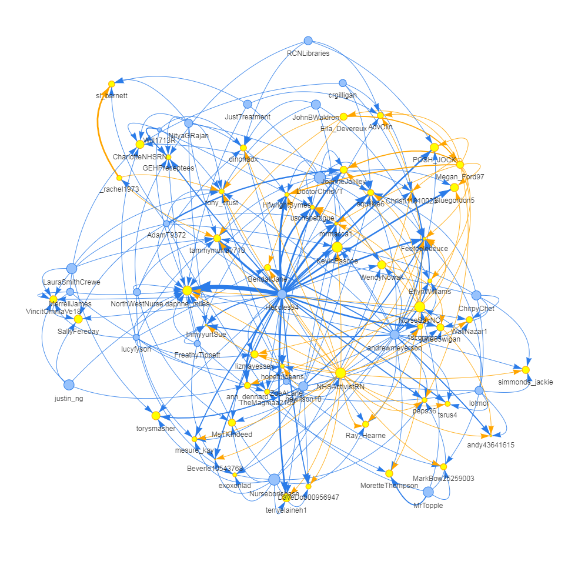

## Twitter graph analysis

<table>
<td>
  

    
Bard Chatbot Launch

    
  

</td>
<td>
  

    
China Spy Balloon

    
  

</td>
<td>
  

    
Eurovision Song Competition

    
  

</td>
<td>
  

    
UK Nurses Strike

    
  

</td>
<td>
  

    
Six Nations Rugby Championship

    
  

</td> 
</table>

### Project objectives

Compare the graphs of the Twitter hash tags of five significant current events in terms of:

- Ability to diffuse information
- Node and link structure
- Nefarious bot/misinformation behaviour

The hashtags considered cover technology (#bard), international affairs (#ChinaSpyBallon), entertainment (#Eurovision2023), politics (#NursesStrike) and sports (#SixNations2023)
  
### Analysis approach

cf. code 'hashtag_graphs.ipynb'

### Results/findings

